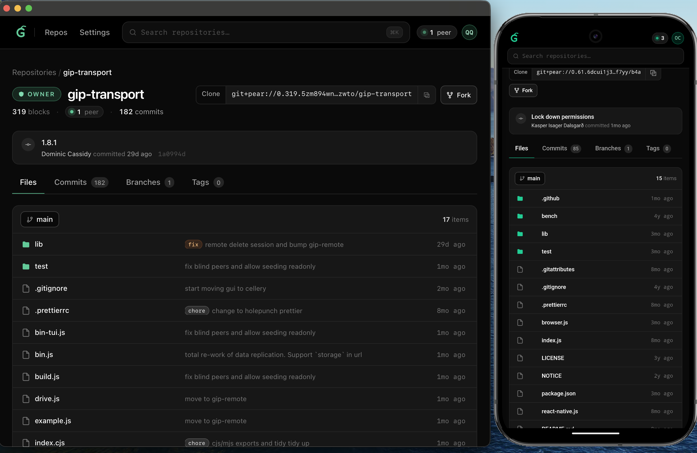

# Gear

A P2P Git repository manager built on [Pear](https://pears.com) / [Holepunch](https://holepunch.to). Browse, clone, and publish Git repositories over the Hypercore protocol — no central server required.



## Features

- **Browse repositories** — file tree, commits, branches, and tags served directly from Hypercore drives
- **P2P sync** — repositories replicate peer-to-peer via Hyperswarm; peer count shown live
- **Discover** — a curated list of available repositories, baked into the app and updateable OTA via hyperconf — works offline, no network needed
- **Add by URL** — paste a `git+pear://` URL to start syncing any public repository instantly
- **Create repositories** — publish a new repo directly to the network
- **Blind peers** — stays reachable behind NAT without a public IP
- **Mobile** — runs natively on Android via the Bare runtime

## Stack

| Layer         | Technology                                                    |
| ------------- | ------------------------------------------------------------- |
| UI            | SvelteKit 2 + Svelte 5 + Tailwind CSS 4                       |
| Runtime       | [Bare](https://github.com/holepunchto/bare) (macOS + Android) |
| P2P transport | gip-transport, Hyperswarm, HyperDB                            |
| OTA           | hyperconf                                                     |
| Bundler       | bare-build + sveltekit-adapter-bare                           |

## Development

```sh
npm install
npm run dev
```

The dev server runs in Node.js mode. The Pear stack (gip-transport, Hyperswarm) boots as a singleton on first request and stays alive for the session.

## Building

**1. Compile the SvelteKit app:**

```sh
npm run build
```

**2. Package for your target platform:**

```sh
# macOS (Apple Silicon)
npm run make:darwin-arm64

# Android (arm64)
npm run make:android-arm64
```

Output bundles land in `out/`. The bare-build step resolves all native addons (sodium-native, utp-native, etc.) using `bare-module-resolve`, so the bundle is self-contained.

## Releasing

```sh
npm run release                    # all platforms, signed
npm run release -- --darwin-arm64  # one platform
npm run release -- --unsigned      # macOS without signing/notarization
```

macOS builds are signed with the Developer ID identity, notarized (keychain
profile `gear`, override with `NOTARIZE_PROFILE`) and stapled, then packed
into a dmg. Android builds are signed when `ANDROID_KEYSTORE`,
`ANDROID_KEYSTORE_KEY` and `ANDROID_KEYSTORE_PASSWORD` are set (a `.env` file
in the project root is picked up). The marketing version comes from
`package.json`; the Android `versionCode` is the git commit count.

## Discover

The list of available repositories is a fixed manifest, not a network query.
It lives in `ota/sources.js` and is baked into the app as a
[hyperconf](https://github.com/holepunchto/hyperconf) spec, so Discover works
with no network at all. A hypercore (key in `ota/key.js`) carries newer config
blocks; whenever one replicates in, every client flips to it — OTA updates
without shipping a build.

Each source carries its own blind-peer keys, which are passed to `addRemote` so
a freshly added repo can replicate even when its author is offline. The loader
streams the manifest, so the local repo list paints first and Discover fills in
once the config resolves.

To change what's on offer, edit `ota/sources.js` and run:

```sh
npm run ota                  # re-bake the spec into ota/spec (commit it)
npm run ota -- --publish     # also append the config to the OTA core and seed it
```

Publishing requires the writer core in `ota/writer` — it holds the secret key,
is gitignored, and exists only on the machine that ran `npm run ota -- --init`.
Back it up.
